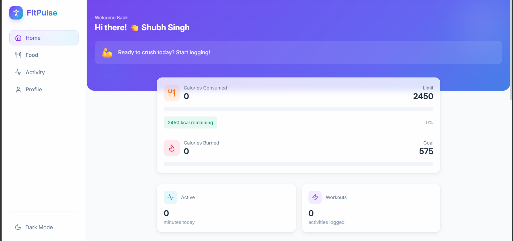
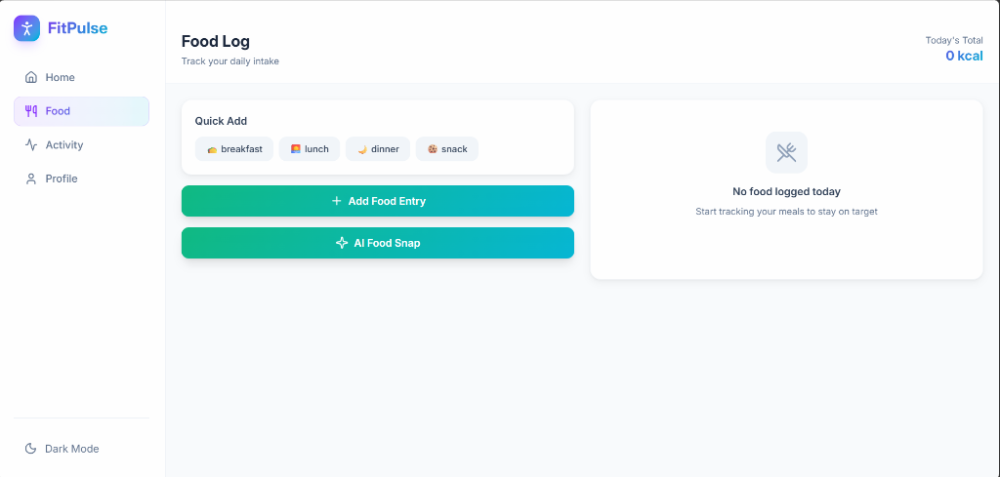
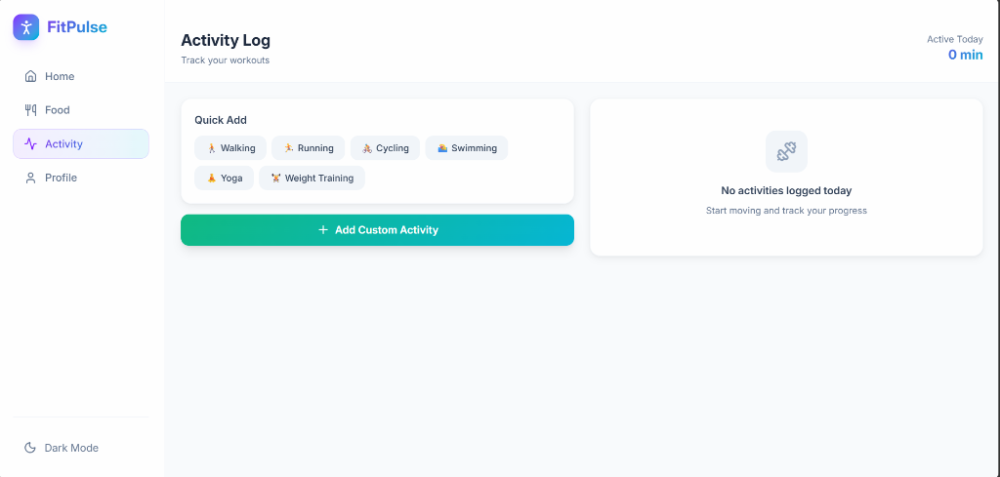
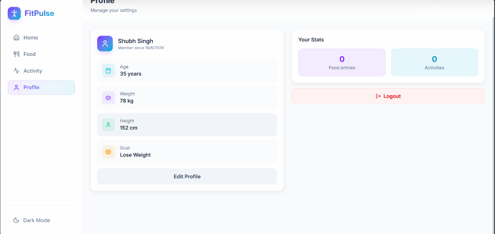

<div align="center">


# 🏃 FitPulse

### Your AI-Powered Personal Fitness & Nutrition Companion

[](https://reactjs.org/)
[](https://www.typescriptlang.org/)
[](https://strapi.io/)
[](https://vite.dev/)
[](https://ai.google.dev/)
[](https://tailwindcss.com/)

[](https://fit-pulse-wine.vercel.app)

<br/>

**🔗 Live Demo**: [https://fit-pulse-wine.vercel.app](https://fit-pulse-wine.vercel.app)  
**⚡ Backend API**: `https://fitpulse-y2au.onrender.com`

<br/>

**FitPulse** is a full-stack fitness tracking web application that lets you log meals, track workouts, and use **Google Gemini AI** to analyze food photos — all in one sleek, responsive interface.

<br/>

[🚀 Live Demo](https://fit-pulse-wine.vercel.app) · [✨ Features](#-features) · [📸 Screenshots](#-screenshots) · [🛠 Tech Stack](#-tech-stack) · [🚀 Getting Started](#-getting-started) · [📁 Project Structure](#-project-structure)

</div>

---

## ✨ Features

| Feature | Description |
|---|---|
| 🔐 **Auth System** | Secure JWT-based login & registration via Strapi Users & Permissions |
| 🤖 **AI Food Snap** | Upload a food photo → Google Gemini AI auto-detects name & calories |
| 🍽 **Food Logger** | Log meals by type (Breakfast / Lunch / Dinner / Snack) with calorie tracking |
| 🏋️ **Activity Tracker** | Log workouts with duration & calories burned; smart auto-calorie estimation |
| 📊 **Dashboard** | Real-time daily summary, progress bars, BMI calculator & weekly charts |
| 👤 **Profile Manager** | Update age, weight, height, goal, calorie limits — with live BMI feedback |
| 🧭 **Onboarding Flow** | Multi-step guided setup for new users with goal-based calorie calculation |
| 🌙 **Dark Mode** | Full dark/light theme toggle with system preference detection |
| 📱 **Responsive Design** | Mobile-first with bottom nav; desktop sidebar layout |

---

## 📸 Screenshots

### 🏠 Dashboard
> Real-time calorie tracking, activity summary, BMI card & motivational messages



---

### 🍽 Food Log
> Log meals manually or use **AI Food Snap** to analyze photos with Gemini AI



---

### 🏋️ Activity Log
> Track workouts with quick-add presets or custom activities



---

### 👤 Profile
> View & edit your fitness profile, body metrics and personal goals



---

## 🛠 Tech Stack

### Frontend (`/client`)
```
React 18 + TypeScript     → Component framework
Vite 8                    → Lightning-fast dev server & bundler
TailwindCSS v4            → Utility-first styling
React Router v6           → Client-side routing
Axios                     → HTTP client with JWT interceptors
Recharts                  → Beautiful data charts
React Hot Toast           → Elegant notifications
Lucide React              → Crisp icon library
```

### Backend (`/server`)
```
Strapi 5                  → Headless CMS & REST API
SQLite (better-sqlite3)   → Lightweight dev database
@google/genai             → Google Gemini AI SDK
JWT + Users & Permissions → Authentication & authorization
```

---

## 🚀 Getting Started

### Prerequisites
- **Node.js** `>= 20.x`
- **npm** `>= 6.x`
- A **Google Gemini API key** ([Get one free →](https://aistudio.google.com/))

---

### 1. Clone the Repository

```bash
git clone https://github.com/ankitpal85/FitPulse.git
cd FitPulse
```

---

### 2. Setup the Backend (Strapi)

```bash
cd server
npm install
```

Create the environment file:

```bash
cp .env.example .env
```

Edit `server/.env` and fill in:

```env
HOST=0.0.0.0
PORT=1337
APP_KEYS=your-app-keys-here
API_TOKEN_SALT=your-token-salt
ADMIN_JWT_SECRET=your-admin-jwt-secret
TRANSFER_TOKEN_SALT=your-transfer-salt
JWT_SECRET=your-jwt-secret
GEMINI_API_KEY=your-google-gemini-api-key
```

Start the Strapi server:

```bash
npm run dev
```

> Strapi admin panel → **http://localhost:1337/admin**

---

### 3. Configure Strapi Permissions *(One-time setup)*

After Strapi boots for the first time:

1. Open **http://localhost:1337/admin**
2. Go to **Settings → Users & Permissions → Roles → Authenticated**
3. Enable all actions for:
   - ✅ `food-log` (find, findOne, create, update, delete)
   - ✅ `activity-log` (find, findOne, create, update, delete)
   - ✅ `image-analysis` (analyze)
4. Click **Save**

---

### 4. Setup the Frontend (React + Vite)

```bash
cd ../client
npm install
```

Create the environment file:

```bash
cp .env.example .env
```

`client/.env`:

```env
# Leave empty in development — Vite proxy forwards /api → localhost:1337
VITE_API_URL=
```

Start the dev server:

```bash
npm run dev
```

> App → **http://localhost:5173**

---

### 5. Register & Start Tracking! 🎉

1. Open **http://localhost:5173**
2. Click **Sign Up** → create your account
3. Complete the **Onboarding** (set age, weight, height, goal)
4. Start logging food 🍽 and activities 🏋️!

---

## 📁 Project Structure

```
FitPulse/
├── client/                          # React Frontend
│   ├── src/
│   │   ├── assets/                  # Static assets & helper data
│   │   ├── components/
│   │   │   ├── ui/                  # Reusable UI: Button, Card, Input, Select...
│   │   │   ├── BottomNav.tsx        # Mobile bottom navigation
│   │   │   ├── Sidebar.tsx          # Desktop sidebar
│   │   │   ├── CaloriesChart.tsx    # Weekly progress chart
│   │   │   └── ErrorBoundary.tsx    # Graceful error fallback
│   │   ├── configs/
│   │   │   └── api.ts               # Axios instance + JWT interceptor
│   │   ├── context/
│   │   │   ├── AppContext.tsx        # Global state (user, logs, auth)
│   │   │   └── ThemeContext.tsx      # Dark/light mode
│   │   ├── pages/
│   │   │   ├── Login.tsx            # Auth page (login + register)
│   │   │   ├── Onboarding.tsx       # New user setup wizard
│   │   │   ├── Dashboard.tsx        # Home with daily stats
│   │   │   ├── FoodLog.tsx          # Food tracking + AI Snap
│   │   │   ├── Activity.tsx         # Workout tracker
│   │   │   ├── Profile.tsx          # User profile & settings
│   │   │   └── Layout.tsx           # App shell with nav
│   │   └── types/index.ts           # TypeScript interfaces
│   └── vite.config.ts               # Vite config with /api proxy
│
└── server/                          # Strapi Backend
    └── src/
        └── api/
            ├── food-log/            # Food log CRUD API
            ├── activity-log/        # Activity log CRUD API
            └── image-analysis/      # Gemini AI food photo analysis
```

---

## 🤖 AI Food Snap — How It Works

```
User uploads photo
        ↓
[Vite Client] sends multipart/form-data to POST /api/image-analysis
        ↓
[Strapi Controller] reads file from temp storage
        ↓
[Google Gemini API] analyzes image → returns { name, calories, protein, carbs, fat }
        ↓
[Client] auto-fills the food log form with detected values
        ↓
User confirms and saves → logged! ✅
```

---

## 🌙 Dark Mode Preview

> The app fully supports dark mode — toggle via the sidebar or profile page

| Light Mode | Dark Mode |
|:---:|:---:|
| Clean white UI | Deep dark theme |
| Soft card shadows | Glassmorphism accents |
| Violet-Cyan gradient | Same gradient, darker bg |

---

## 🙌 Contributing

Pull requests are welcome! For major changes, please open an issue first.

1. Fork the repository
2. Create your feature branch: `git checkout -b feature/amazing-feature`
3. Commit changes: `git commit -m 'Add amazing feature'`
4. Push: `git push origin feature/amazing-feature`
5. Open a Pull Request

---

## 📄 License

MIT © [Ankit Pal](https://github.com/ankitpal85)

---

<div align="center">

Made with ❤️ and a lot of ☕ by **Ankit Pal**

⭐ **Star this repo if you found it useful!** ⭐

</div>
